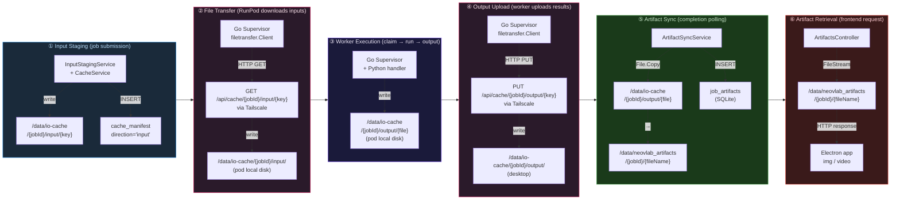
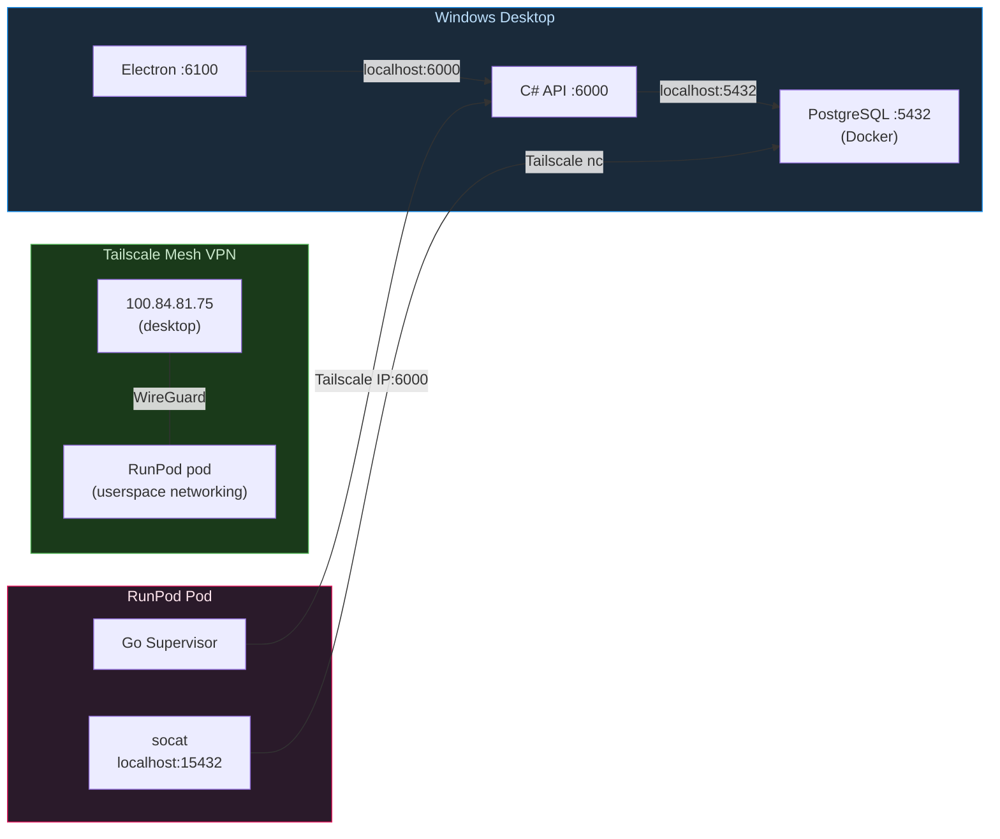

# Application Topology

> Auto-generated by `scripts/trace_app_topology.py` — do not edit manually.

## 1. Service Topology

Shows all services, their roles, and how they communicate.

```mermaid
flowchart TD
    FE["**Frontend**\nElectron + React\n:6100"]

    subgraph BackendAPI["Backend API (.NET 9)  :6000"]
        JC["JobsController\n/api/jobs"]
        AC["ArtifactsController\n/api/artifacts"]
        CTC["CacheTransferController\n/api/cache\n(input download / output upload)"]
        HUB["NeoVLabHub\n/hubs/neovlab  (SignalR)"]
        JQS["JobQueueService\nenqueue + stage inputs"]
        ISS["InputStagingService\nstage inputs to io-cache"]
        ArtSvc["ArtifactSyncService\npoll cluster completions"]
        CS["CacheService\nio-cache reads / writes"]
        CEvict["CacheEvictionService\nLRU eviction"]
        RPGA["RunPodGpuPlatformAdapter\nRunPod GraphQL API\n(pod status, start/stop)"]
    end

    subgraph Databases["Databases"]
        LocalDB[("Local SQLite\nneovlab.db\nprocessing_jobs\njob_artifacts\nmedia_assets")]
        ClusterDB[("Cluster DB\nPostgreSQL (Docker)\npgvector/pgvector:pg16\njob_queue, cache_manifest\nworker_registry, handler_config\npipeline_jobs, persons\nface_detections, transcriptions")]
    end

    subgraph RunPodWorker["RunPod GPU Pod"]
        direction TB
        ENTRY["entrypoint.sh\n(sshd, FileBrowser, JupyterLab)"]
        TS["Tailscale\nuserspace networking"]
        SOCAT["socat tunnel\nlocalhost:15432 → desktop:5432"]
        SUP["Go Supervisor\n/usr/local/bin/supervisor"]
        COMFY["ComfyUI :8188"]
        H_TRANS["transcription :9001"]
        H_DIAR["diarization :9002"]
        H_FACE["face_extraction :9003"]
        H_VTAG["visual_tagging :9004"]
    end

    subgraph LocalStorage["Local Storage (Desktop)"]
        VOL_CACHE[("io-cache\n/data/io-cache")]
        VOL_ART[("artifact-data\n/data/neovlab_artifacts")]
    end

    subgraph RunPodStorage["RunPod Storage"]
        NET_VOL[("Network Volume\n/workspace\nComfyUI models")]
        POD_CACHE[("/data/io-cache\n(ephemeral pod storage)")]
    end

    FE -->|"HTTP REST"| JC
    FE -->|"HTTP REST"| AC
    FE <-->|"SignalR WebSocket"| HUB

    JC --> JQS
    JQS --> ISS
    ISS --> CS
    CS -->|"write inputs"| VOL_CACHE
    ISS --> CMR["CacheManifestRepository\nINSERT cache_manifest (input)"]
    CMR --> ClusterDB
    JQS -->|"INSERT job_queue"| ClusterDB
    JQS -.->|"EnsureWarmAsync\n(check pod status)"| RPGA
    RPGA -.->|"GraphQL: pod status"| RunPodWorker

    SUP -->|"claim_next_job\n(FOR UPDATE SKIP LOCKED)"| ClusterDB
    SUP -->|"heartbeat, lease renewal"| ClusterDB
    SUP -->|"HTTP POST /handle"| H_TRANS
    SUP -->|"HTTP POST /handle"| H_DIAR
    SUP -->|"HTTP POST /handle"| H_FACE
    SUP -->|"HTTP POST /handle"| H_VTAG
    SUP -->|"POST /prompt\nGET /history"| COMFY

    SUP -->|"GET /api/cache/{jobId}/input/{key}\n(download inputs)"| CTC
    SUP -->|"PUT /api/cache/{jobId}/output/{key}\n(upload outputs)"| CTC
    CTC -->|"read/write"| VOL_CACHE

    TS -->|"Tailscale mesh VPN\nWireGuard tunnel"| ClusterDB
    TS -->|"Tailscale mesh VPN"| CTC
    SOCAT -->|"TCP bridge\nlocalhost:15432"| TS

    ArtSvc -->|"poll completed jobs"| ClusterDB
    ArtSvc -->|"File.Exists → read outputs"| VOL_CACHE
    ArtSvc -->|"File.Copy → artifacts"| VOL_ART
    ArtSvc -->|"INSERT job_artifacts"| LocalDB
    ArtSvc -->|"broadcast events"| HUB

    CEvict -->|"mark evicted in cache_manifest"| ClusterDB
    CEvict -->|"DELETE local cache files"| VOL_CACHE

    AC -->|"SELECT job_artifacts"| LocalDB
    AC -->|"read FileStream"| VOL_ART
    AC -->|"HTTP response (file stream)"| FE

    style FE fill:#1a3a4a,stroke:#00bcd4,color:#e0f7fa
    style BackendAPI fill:#1a2a1a,stroke:#4caf50,color:#c8e6c9
    style Databases fill:#2a1a1a,stroke:#f44336,color:#ffcdd2
    style RunPodWorker fill:#2a1a2a,stroke:#e91e63,color:#fce4ec
    style LocalStorage fill:#2a2a1a,stroke:#ff9800,color:#fff3e0
    style RunPodStorage fill:#3a2a1a,stroke:#ff6f00,color:#ffe0b2
```

## 2. Storage & File Transfer Flow

Shows how files move between the desktop API and the RunPod GPU worker.

## 3. Network Topology

## 4. Port & Endpoint Reference

| Service | Port | Protocol | Purpose |
|---|---|---|---|
| Electron Frontend | 6100 | HTTP | User interface |
| Backend API | 6000 | HTTP + WS | REST + SignalR hub + CacheTransfer |
| PostgreSQL (Docker) | 5432 | TCP | Job queue, cache manifest, worker registry |
| RunPod SSH | 22 | TCP | Pod shell access |
| RunPod FileBrowser | 8080 | HTTP | File management UI |
| RunPod JupyterLab | 8888 | HTTP | Debugging notebooks |
| ComfyUI (on pod) | 8188 | HTTP | Image/video generation |
| transcription handler | 9001 | HTTP | Whisper (on pod) |
| diarization handler | 9002 | HTTP | pyannote (on pod) |
| face_extraction handler | 9003 | HTTP | InsightFace (on pod) |
| visual_tagging handler | 9004 | HTTP | ViT-B/16 (on pod) |
| socat tunnel (on pod) | 15432 | TCP | Bridge to desktop Postgres via Tailscale |
