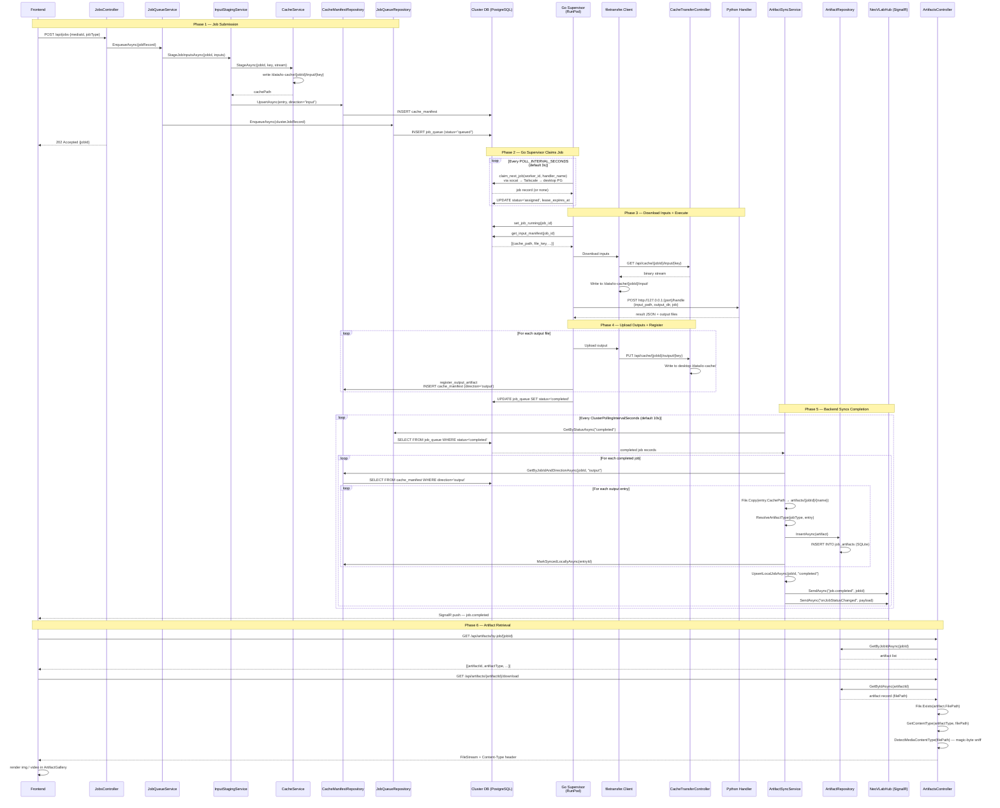
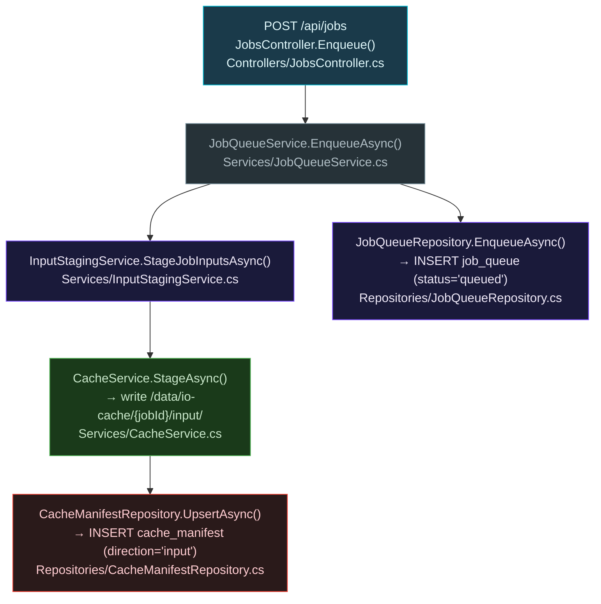
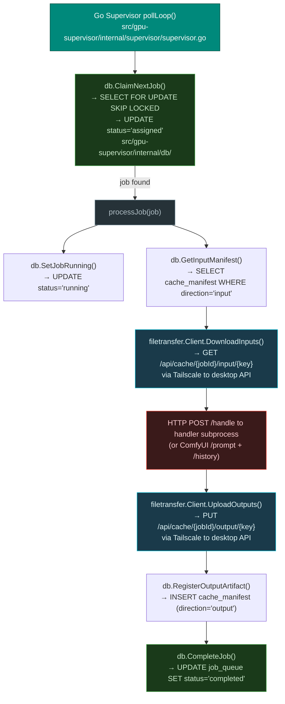
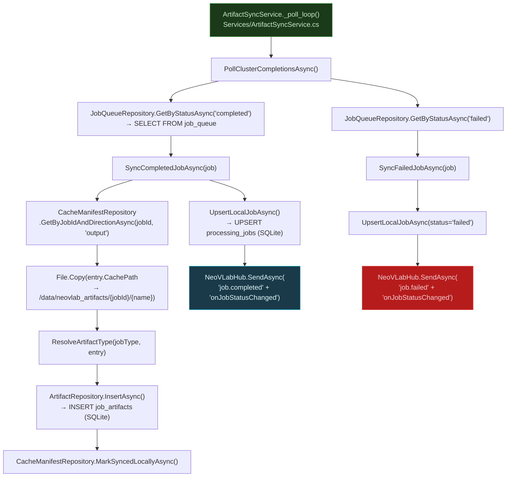
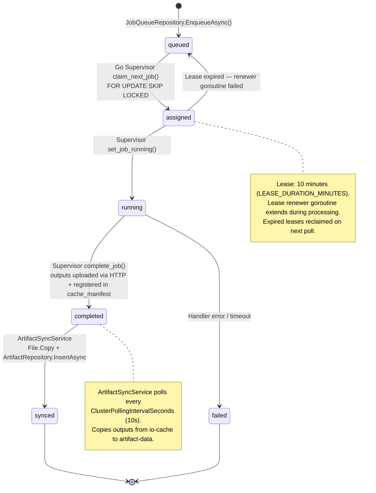

# Artifact Function Flows

> Auto-generated by `scripts/trace_artifact_functions.py` — do not edit manually.
> Reflects the RunPod pull-model architecture with HTTP file transfer.

## 1. Full Artifact Lifecycle — Sequence Diagram

Traces every function call from job submission to frontend render.

## 2. Submission — Function Call Hierarchy

## 3. Worker Execution — Function Call Hierarchy

## 4. Artifact Sync — Function Call Hierarchy

## 5. Artifact State Transitions

