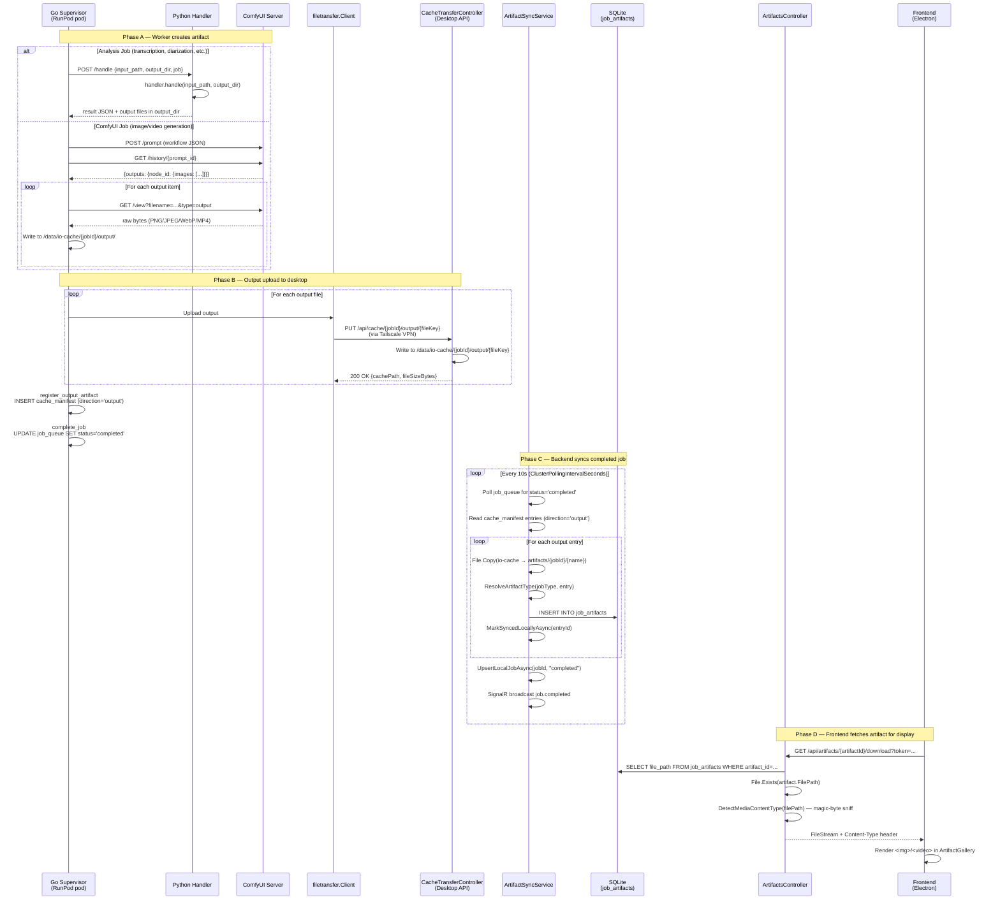
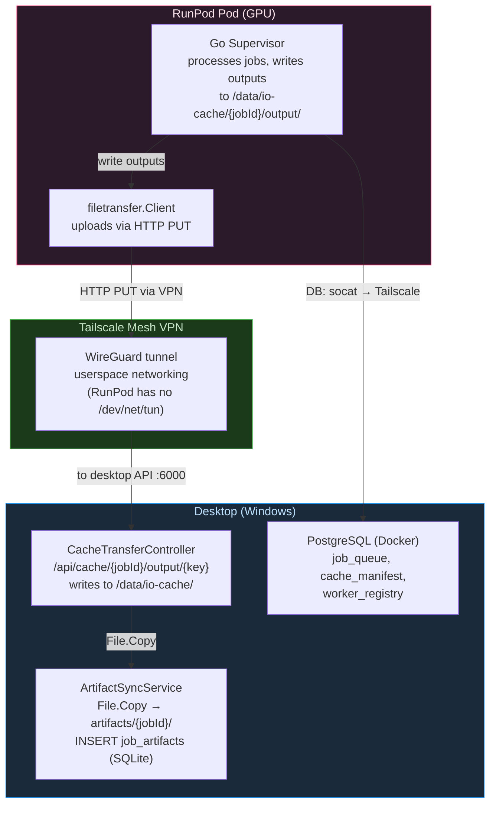

# Artifact Lifecycle

> Auto-generated by `scripts/trace_artifact_flow.py` — do not edit manually.

## 1. End-to-End Sequence Diagram

Shows every hop an artifact takes from worker creation to user browser.

## 2. Storage Hop Diagram

Shows where the file physically lives at each stage.

```mermaid
flowchart LR
    subgraph RunPod["RunPod Pod"]
        A["Handler output\n(output_dir)"]
        B["/data/io-cache\n/{jobId}/output/{file}\n(pod ephemeral disk)"]
    end

    subgraph Transfer["HTTP File Transfer\n(Tailscale VPN)"]
        TX["PUT /api/cache/{jobId}/output/{key}\nGo filetransfer.Client\n→ CacheTransferController"]
    end

    subgraph Desktop["Desktop (io-cache)"]
        C["/data/io-cache\n/{jobId}/output/{file}\n(Docker volume)"]
        CM["cache_manifest\ndirection='output'\ncache_path=C"]
    end

    subgraph Backend["Backend API (ArtifactSyncService)"]
        C1{"File.Exists\n(entry.CachePath)?"}
        C3["artifacts/\n{jobId}/{fileName}"]
        D["job_artifacts\n(SQLite)"]
    end

    subgraph Browser["Electron App"]
        E["GET /api/artifacts/{id}/download"]
    end

    A -->|"write"| B
    B -->|"HTTP PUT"| TX
    TX -->|"write"| C
    C -->|"INSERT cache_path"| CM
    CM -->|"ArtifactSyncService reads\ncache_manifest"| C1
    C1 -->|"found locally"| C3
    C3 -->|"INSERT file_path"| D
    D -->|"File.Exists + FileStream"| E

    style A fill:#2d2d2d,stroke:#555,color:#aaa
    style B fill:#2a1a2a,stroke:#e91e63,color:#fce4ec
    style TX fill:#1a3a4a,stroke:#00bcd4,color:#e0f7fa
    style C fill:#1a3a4a,stroke:#00bcd4,color:#e0f7fa
    style CM fill:#263238,stroke:#78909c,color:#b0bec5
    style C1 fill:#2a1a1a,stroke:#f44336,color:#ffcdd2
    style C3 fill:#1a3a4a,stroke:#00bcd4,color:#e0f7fa
    style D fill:#263238,stroke:#78909c,color:#b0bec5
    style E fill:#1b5e20,stroke:#4caf50,color:#c8e6c9
```

## 3. Environment Variables & Config Keys

| Variable / Config | Used By | Default | Purpose |
|---|---|---|---|
| `IO_CACHE_DIR` | Go Supervisor | `/data/io-cache` | Base dir for worker input/output cache on pod |
| `DATABASE_URL` | Go Supervisor | required | PostgreSQL via socat (localhost:15432) |
| `NEOVLAB_API_BASE_URL` | Go Supervisor | required | Desktop API URL via Tailscale for file transfer |
| `WORKER_TOKEN` | Both | `""` | Auth token — must match `Gpu:RunPod:WorkerToken` in API |
| `ENABLED_HANDLERS` | Go Supervisor | all | Comma-separated handler list |
| `LEASE_DURATION_MINUTES` | Go Supervisor | `10` | How long a claimed job is held before reclaimable |
| `Storage:ArtifactsPath` | Backend API | `"artifacts"` | Local permanent artifact storage path |
| `Storage:IoCachePath` | Backend API | `"data/io-cache"` | Local io-cache base path |

## 4. Deployment Topology

Shows the current RunPod deployment and how artifacts flow between pod and desktop.

## 5. Known Issues & Status

| # | Issue | Impact | Status |
|---|---|---|---|
| 1 | `EnsureWarmAsync` never called on GPU job submission | Pod status not checked, jobs queue silently | **Fixed** |
| 2 | `ArtifactSyncService` uses `File.Exists` only — no GCS fallback | No longer needed: outputs uploaded to desktop via HTTP | **Resolved by arch** |
| 3 | No lease renewal during long-running jobs | 10-min lease expires on 30-min ComfyUI jobs | **Fixed** |
| 4 | Windows path sent to Linux handler without NEOVLAB_API_BASE_URL | ffmpeg "Protocol not found" error | **Fixed** |
| 5 | No thumbnail generation for catalog media | MediaCard uses full video stream as thumbnail | Deferred |
