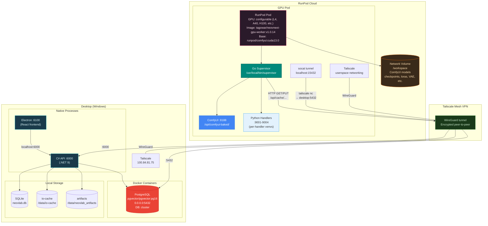
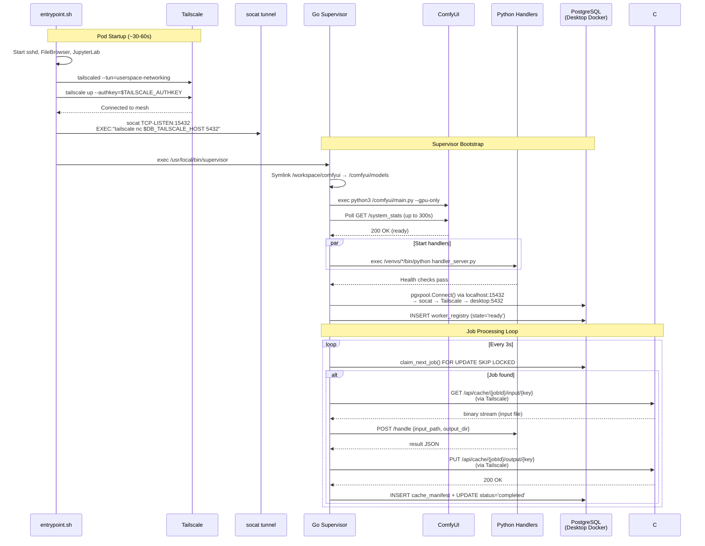
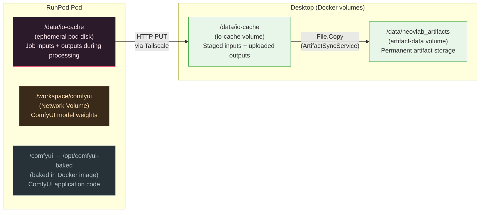

# Infrastructure Topology

> **Note:** GPU workloads have migrated from GCP Cloud Run to RunPod. This document
> reflects the current RunPod + local infrastructure architecture. For legacy GCP
> documentation, see `docs/archive/`.

## RunPod + Desktop Architecture

## Network Data Flow

## Storage Hierarchy

## Cost Comparison (RunPod vs. former GCP)

| Resource | RunPod (current) | GCP Cloud Run (former) |
|----------|-----------------|----------------------|
| **GPU compute** | ~$0.50-0.74/hr (L4/A40) | $0.65/hr (L4) + overhead |
| **Idle cost** | $0/hr (pod stopped) | $0/hr (scale-to-zero) |
| **Storage** | Network Volume: $0.07/GB/mo | Filestore NFS: $40.96/mo (1 TiB min) |
| **Database** | Local Docker PG: $0 | Cloud SQL: $14.20/mo |
| **Networking** | Tailscale (free tier) | VPC + Private Google Access |
| **Typical monthly** | **~$30-50** (light use) | **~$320** (light use) |

## Key Configuration

### RunPod Pod

| Setting | Value |
|---------|-------|
| Docker Image | `tagowar/neovnext-gpu-worker:v1.0.14` |
| GPU | Configurable per pod (L4, A40, H100) |
| Network Volume | `/workspace` (ComfyUI models) |
| Exposed Ports | 22 (SSH), 8080 (FileBrowser), 8188 (ComfyUI), 8888 (JupyterLab) |

### Desktop Infrastructure

| Component | Details |
|-----------|---------|
| PostgreSQL | `pgvector/pgvector:pg16` in Docker, port 5432 (all interfaces) |
| C# API | .NET 9, port 6000, with CacheTransferController |
| Electron Frontend | React, port 6100 |
| Tailscale | IP 100.84.81.75 |
| Port Proxy | `setup-portproxy.ps1` bridges Tailscale IP to Docker ports |
| Firewall | `setup-tailscale-firewall.ps1` allows Tailscale traffic |

### Database Schema (9 migrations)

| Migration | Tables |
|-----------|--------|
| 001 | job_queue, worker_registry, cache_manifest |
| 002 | cache_manifest.gcs_evicted_at |
| 003 | thumbnails |
| 004 | staged_inputs |
| 005 | face_detections (pgvector 512-dim) |
| 006 | transcriptions (FTS tsvector) |
| 007 | speaker_segments (pgvector 192-dim) |
| 008 | handler_config |
| 009 | pipeline_jobs, pipeline_child_jobs, persons |

---

**See Also:** [worker-architecture.md](worker-architecture.md) for handler details, [gpu-supervisor.md](gpu-supervisor.md) for Go supervisor internals
