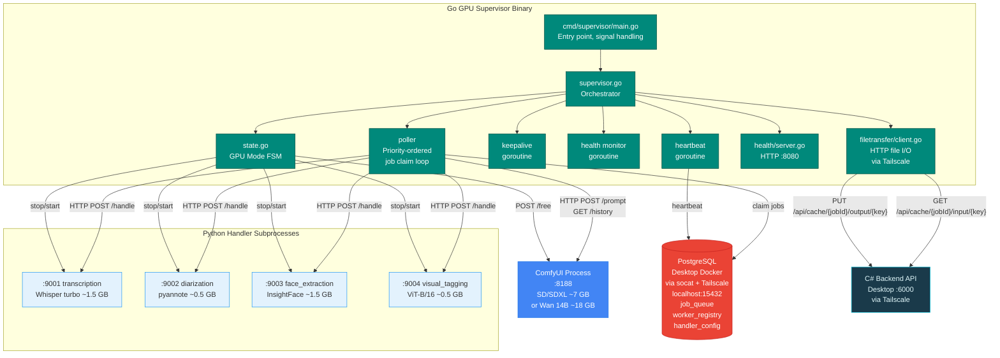
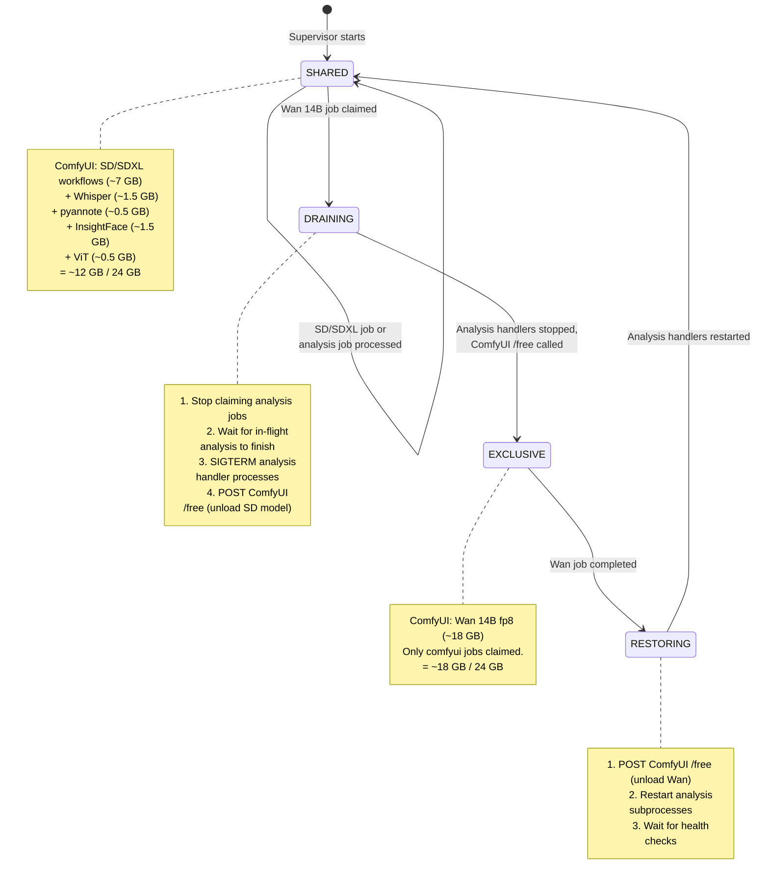
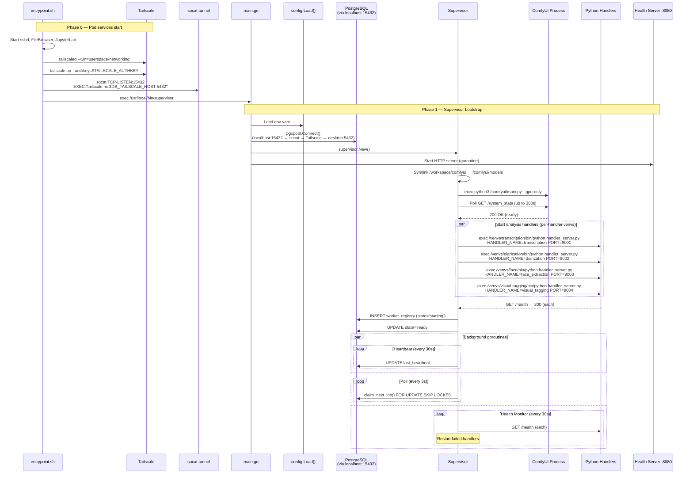
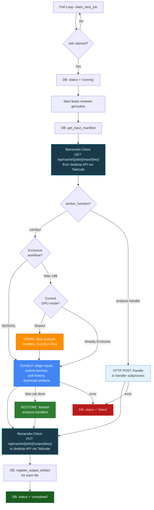
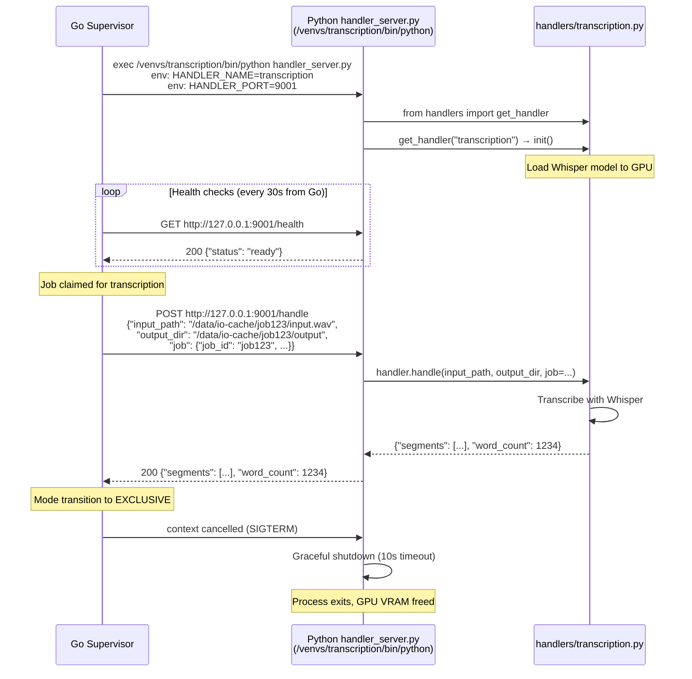
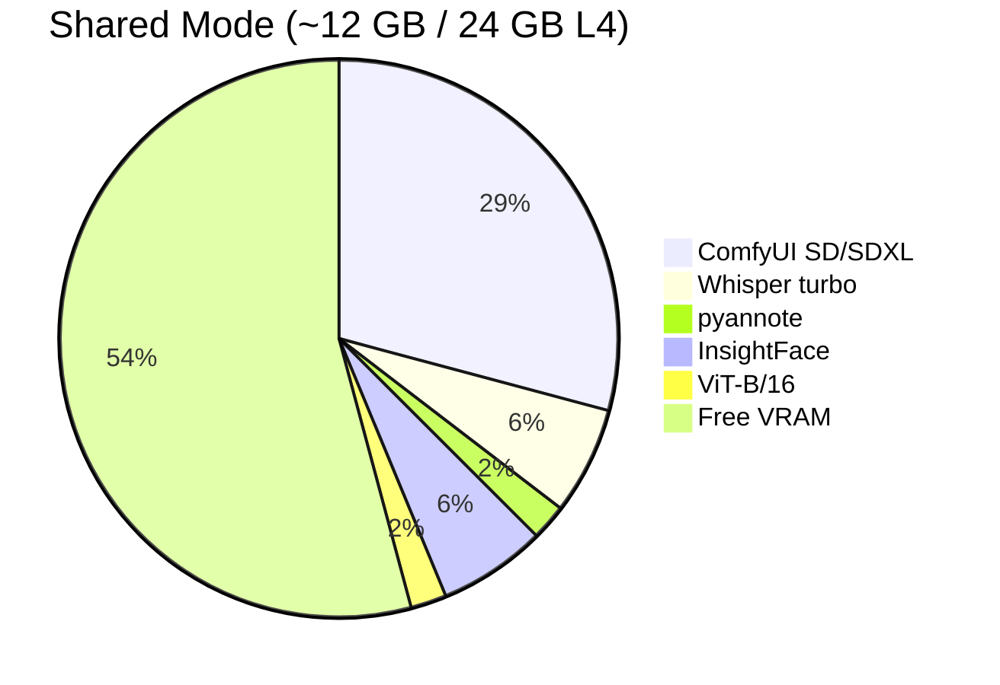
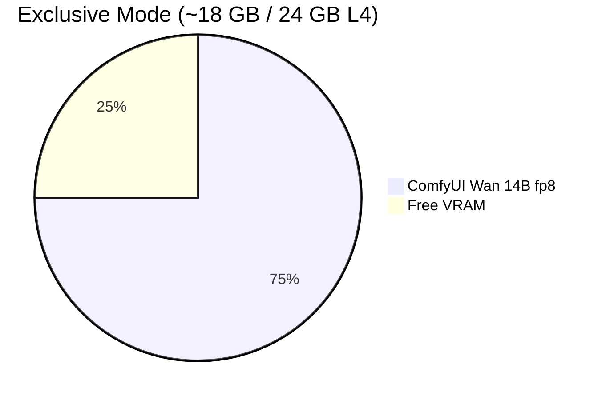
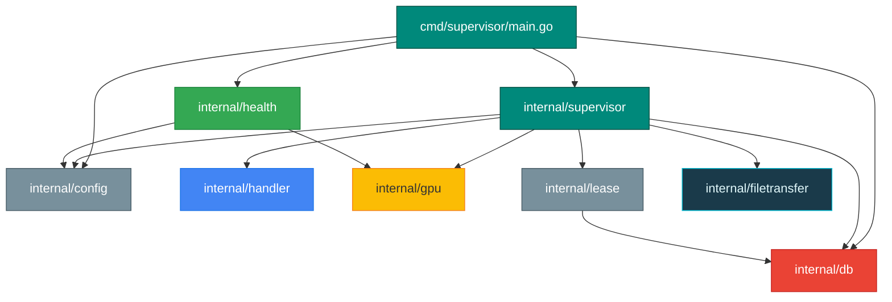

# Go GPU Supervisor Architecture

> Auto-generated by `scripts/trace_gpu_supervisor.py` — do not edit manually.

The Go GPU Supervisor is a compiled binary that runs on a RunPod GPU pod. It manages
ComfyUI and Python ML handler subprocesses, with intelligent GPU mode switching between
shared and exclusive VRAM allocation. It communicates with the desktop C# API via
Tailscale VPN for file transfer and connects to local PostgreSQL via a socat tunnel.

## 1. High-Level Architecture

## 2. GPU Mode State Machine

The supervisor manages two GPU allocation modes to maximize L4 (24 GB) utilization.

## 3. Supervisor Startup Sequence

## 4. Job Processing Flow (with HTTP File Transfer)

## 5. Handler Subprocess Protocol

## 6. VRAM Budget by Mode

## 7. Go Package Dependency Graph

## 8. Configuration (Environment Variables)

### RunPod Pod Environment

| Variable | Default | Purpose |
|---|---|---|
| `DATABASE_URL` | — | PostgreSQL connection string (uses localhost:15432 via socat) |
| `DB_TAILSCALE_HOST` | — | Desktop Tailscale IP for socat tunnel target |
| `NEOVLAB_API_BASE_URL` | — | Desktop API URL via Tailscale (e.g., http://100.84.81.75:6000) |
| `TAILSCALE_AUTHKEY` | — | Reusable ephemeral Tailscale auth key |
| `HUGGINGFACE_TOKEN` | — | HuggingFace token for pyannote diarization |
| `WORKER_ID` | auto-generated | Unique worker identifier |
| `WORKER_TOKEN` | — | Bearer auth token (must match API config) |
| `WORKER_PROCESSING_TYPE` | `gpu` | Worker type |
| `ENABLED_HANDLERS` | `comfyui,face_extraction,...` | Comma-separated handler list |
| `POLL_INTERVAL_SECONDS` | `3` | Job polling frequency |
| `LEASE_DURATION_MINUTES` | `10` | Job lease timeout |
| `IO_CACHE_DIR` | `/data/io-cache` | Artifact storage path |
| `COMFYUI_BASE_URL` | `http://127.0.0.1:8188` | ComfyUI API endpoint |
| `COMFYUI_STARTUP_TIMEOUT_SECONDS` | `300` | ComfyUI startup wait |
| `COMFYUI_TIMEOUT_SECONDS` | `1800` | ComfyUI job timeout |
| `MODELS_DIR` | `/workspace/comfyui` | Network volume path for ComfyUI models |
| `COMFYUI_DIR` | `/comfyui` | ComfyUI installation path |

### Desktop API Configuration (appsettings.json)

| Config Key | Default | Purpose |
|---|---|---|
| `Gpu:Enabled` | `true` | Enable GPU job dispatch |
| `Gpu:Platform` | `RunPod` | Platform adapter selection |
| `Gpu:RunPod:ApiKey` | — | RunPod API key (or `runpod_key` env var) |
| `Gpu:RunPod:PodId` | — | Direct pod ID (takes priority over PodName) |
| `Gpu:RunPod:PodName` | — | Pod name (resolved to ID via GraphQL) |
| `Gpu:RunPod:GpuType` | `NVIDIA L4` | GPU type for display/logging |
| `Gpu:RunPod:WorkerToken` | — | Token for CacheTransferController auth |
| `Gpu:BudgetCents` | `500` | Monthly GPU budget cap |

## 9. Key Files

| File | Language | Purpose |
|---|---|---|
| `src/gpu-supervisor/cmd/supervisor/main.go` | Go | Entry point, signal handling, bootstrap |
| `src/gpu-supervisor/internal/supervisor/supervisor.go` | Go | Orchestrator, poll loop, mode transitions |
| `src/gpu-supervisor/internal/supervisor/state.go` | Go | GPU mode enum (Shared/Draining/Exclusive/Restoring) |
| `src/gpu-supervisor/internal/handler/comfyui.go` | Go | ComfyUI HTTP client (submit, poll, download) |
| `src/gpu-supervisor/internal/handler/process.go` | Go | Python subprocess lifecycle manager |
| `src/gpu-supervisor/internal/db/*.go` | Go | PostgreSQL queries (pgx) |
| `src/gpu-supervisor/internal/filetransfer/client.go` | Go | HTTP file transfer client (replaces GCS FUSE) |
| `src/gpu-supervisor/internal/gpu/monitor.go` | Go | nvidia-smi VRAM monitoring |
| `src/gpu-supervisor/internal/health/server.go` | Go | HTTP health + capabilities endpoints |
| `src/gpu-supervisor/internal/lease/renewer.go` | Go | Per-job lease renewal goroutine |
| `src/gpu-supervisor/scripts/handler_server.py` | Python | Generic HTTP wrapper for Python ML handlers |
| `docker/worker-gpu-go-runpod.Dockerfile` | Docker | Multi-stage build (Go + runpod/comfyui base) |
| `docker/runpod-entrypoint.sh` | Bash | Pod entrypoint (Tailscale, socat, supervisor) |
