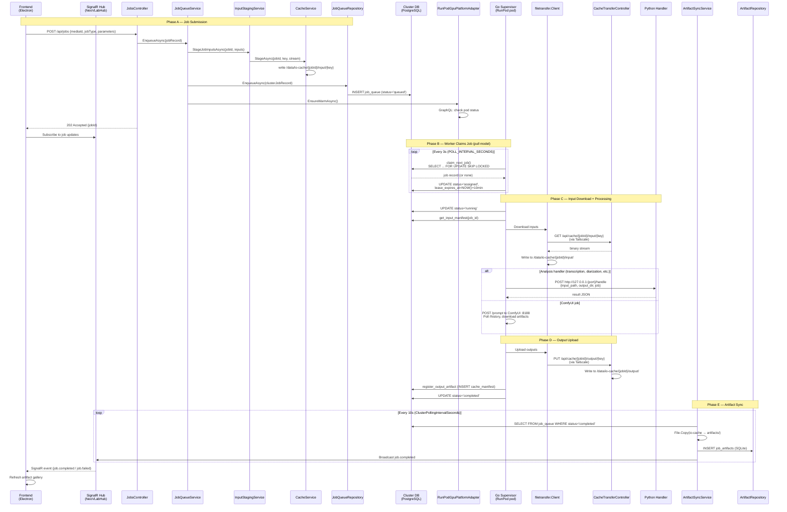
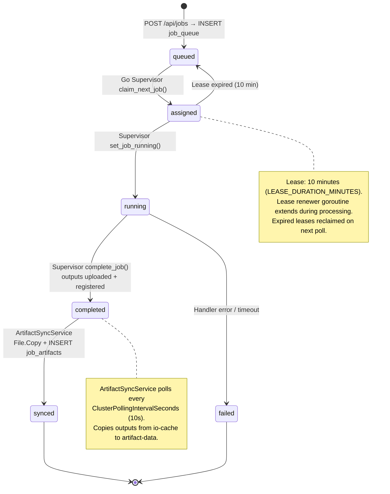
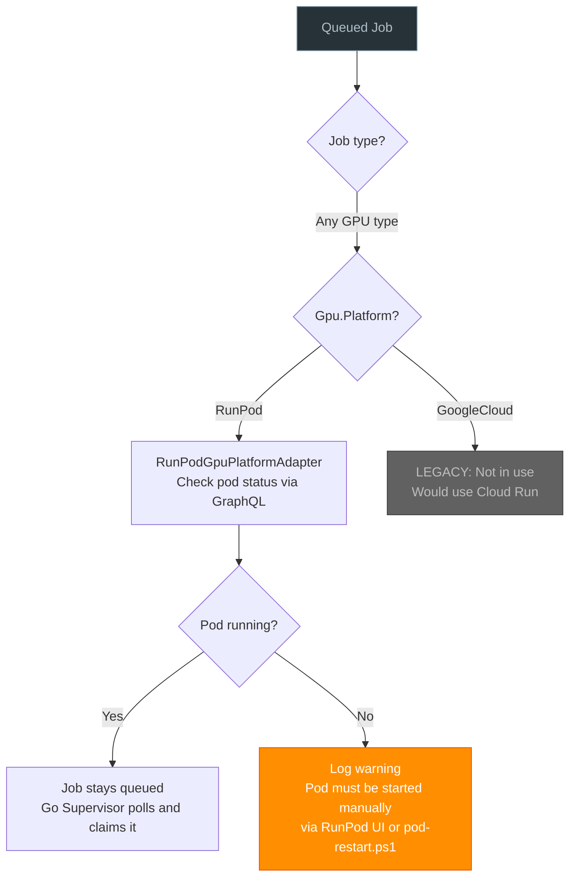

# Job Lifecycle

> Auto-generated by `scripts/trace_job_flow.py` — do not edit manually.

## 1. End-to-End Sequence Diagram

## 2. Job State Machine

## 3. Dispatch Decision Flow

## 4. Key Configuration

| Config Key | Service | Default | Purpose |
|---|---|---|---|
| `Gpu:Enabled` | Backend | `true` | Enable GPU job dispatch |
| `Gpu:Platform` | Backend | `RunPod` | Platform adapter: `RunPod` or `GoogleCloud` |
| `Gpu:RunPod:PodId` | Backend | — | RunPod pod ID (direct) |
| `Gpu:RunPod:PodName` | Backend | — | RunPod pod name (resolved via API) |
| `Gpu:RunPod:ApiKey` | Backend | — | RunPod API key for pod management |
| `Gpu:RunPod:WorkerToken` | Backend | — | Auth token for CacheTransferController |
| `Gpu:BudgetCents` | Backend | `500` | Monthly GPU budget cap |
| `POLL_INTERVAL_SECONDS` | Go Supervisor | `3` | Job polling frequency |
| `LEASE_DURATION_MINUTES` | Go Supervisor | `10` | Job lease timeout |
