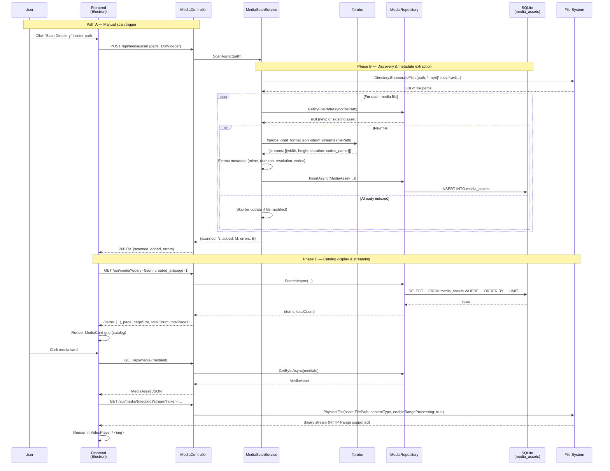
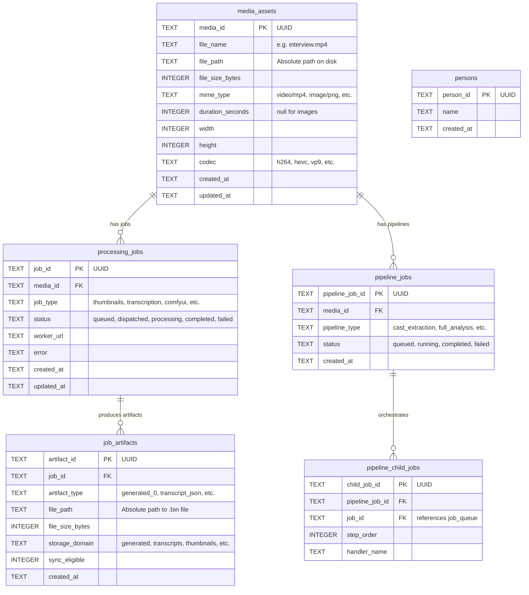
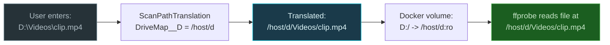

# Media Ingest Pipeline

> Auto-generated by `scripts/trace_media_ingest.py` — do not edit manually.

## 1. Ingest Sequence Diagram

## 2. Data Model

## 3. File Path Translation (Docker)

When the backend runs in Docker, Windows drive paths need translation.

## 4. Streaming Architecture

| Feature | Implementation |
|---|---|
| Content-Type | `asset.MimeType` from DB (set during ffprobe scan) |
| Range Requests | `PhysicalFile(..., enableRangeProcessing: true)` |
| Auth | Bearer token via `Authorization` header or `?token=` query param |
| Thumbnail | Uses same `/stream` endpoint (full file); dedicated thumbnail pipeline planned |
| Formats | mp4, mov, avi, mkv, webm, png, jpg, gif, webp, wav, mp3 |
