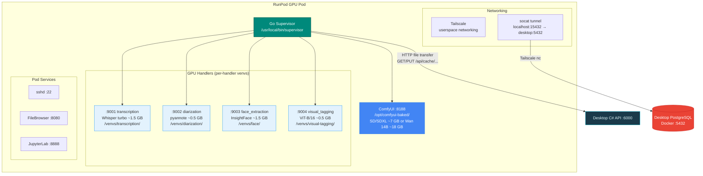
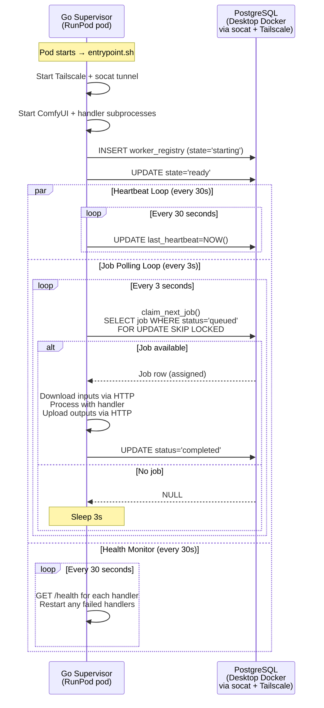
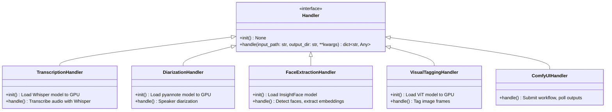
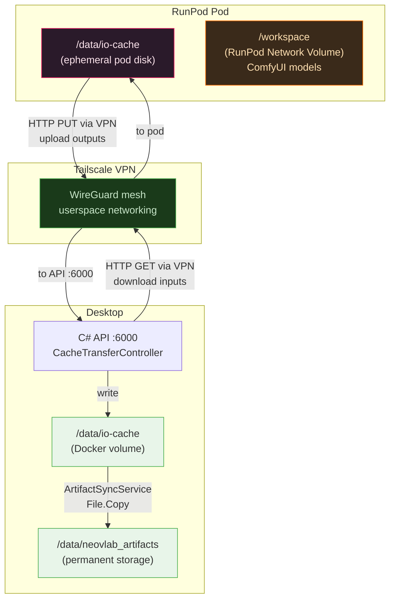

# Worker Architecture

This document visualizes the NeoVNext GPU worker ecosystem running on RunPod infrastructure.

## Worker Architecture Overview

All ML handlers run as Python subprocesses managed by the Go GPU Supervisor on a single
RunPod GPU pod. There are no separate CPU/GPU worker containers — the supervisor handles
everything on the pod, using per-handler Python venvs for isolation.



## Docker Image

- **Base:** `runpod/comfyui:cuda13.0` (Python 3.12, CUDA 13.0, torch 2.10, ComfyUI pre-baked)
- **Dockerfile:** `docker/worker-gpu-go-runpod.Dockerfile`
- **Registry:** Docker Hub `tagowar/neovnext-gpu-worker:v1.0.14`

### Per-Handler Virtual Environments

Each ML handler runs in an isolated venv with `--system-site-packages` to inherit system
torch/numpy without reinstalling. Only handler-specific packages are installed inside each venv.

| Handler | Venv Path | Extra Packages | GPU VRAM |
|---------|-----------|----------------|----------|
| transcription | `/venvs/transcription/` | openai-whisper | ~1.5 GB |
| diarization | `/venvs/diarization/` | pyannote.audio, transformers | ~0.5 GB |
| face_extraction | `/venvs/face/` | insightface, onnxruntime-gpu | ~1.5 GB |
| visual_tagging | `/venvs/visual-tagging/` | timm | ~0.5 GB |
| comfyui | (system python) | Pre-baked in base image | ~7-18 GB |

## Pull-Model Architecture

The Go supervisor uses PostgreSQL row-level locking for job claiming, connecting to the
desktop's PostgreSQL instance via a socat tunnel over Tailscale VPN.



## Handler Contract

All handlers in `src/workers/handlers/` implement the same interface, served via
`handler_server.py` as HTTP endpoints.



### Handler HTTP Protocol

```mermaid
flowchart TD
    START[Job claimed from job_queue]
    DL["Download inputs\nGET /api/cache/{jobId}/input/{key}\nvia Tailscale to desktop API"]
    INIT[handler.init()<br/>Load models if needed]
    HANDLE[POST /handle to handler subprocess<br/>input_path, output_dir, job metadata]

    subgraph "Handler Implementation"
        TRANS[Transcription<br/>Whisper turbo GPU]
        DIAR[Diarization<br/>pyannote GPU]
        FACE[Face Extraction<br/>InsightFace GPU]
        VTAG[Visual Tagging<br/>ViT-B/16 GPU]
        COMFY[ComfyUI Workflow<br/>Submit /prompt, poll /history]
    end

    UL["Upload outputs\nPUT /api/cache/{jobId}/output/{key}\nvia Tailscale to desktop API"]
    REGISTER[INSERT cache_manifest<br/>direction='output']
    COMPLETE[UPDATE job_queue<br/>status='completed']

    START --> DL
    DL --> INIT
    INIT --> HANDLE
    HANDLE --> TRANS
    HANDLE --> DIAR
    HANDLE --> FACE
    HANDLE --> VTAG
    HANDLE --> COMFY
    TRANS --> UL
    DIAR --> UL
    FACE --> UL
    VTAG --> UL
    COMFY --> UL
    UL --> REGISTER
    REGISTER --> COMPLETE

    style DL fill:#1a3a4a,stroke:#00bcd4,color:#e0f7fa
    style UL fill:#1a3a4a,stroke:#00bcd4,color:#e0f7fa
    style TRANS fill:#e3f2fd,stroke:#2196f3
    style DIAR fill:#e3f2fd,stroke:#2196f3
    style FACE fill:#e3f2fd,stroke:#2196f3
    style VTAG fill:#e3f2fd,stroke:#2196f3
    style COMFY fill:#4285f4,stroke:#1a73e8,color:#fff
```

## Storage Access Patterns



## Configuration Environment Variables

### RunPod Pod

| Variable | Purpose | Example |
|----------|---------|---------|
| `DATABASE_URL` | PostgreSQL via socat tunnel | `postgresql://neovlab:pw@localhost:15432/cluster` |
| `DB_TAILSCALE_HOST` | Desktop Tailscale IP for socat target | `100.84.81.75` |
| `NEOVLAB_API_BASE_URL` | Desktop API for file transfer | `http://100.84.81.75:6000` |
| `TAILSCALE_AUTHKEY` | Reusable ephemeral Tailscale key | `tskey-auth-...` |
| `HUGGINGFACE_TOKEN` | HuggingFace token for pyannote | `hf_...` |
| `WORKER_TOKEN` | Auth token (match API config) | `secret123` |
| `ENABLED_HANDLERS` | Comma-separated handler list | `comfyui,transcription,...` |
| `IO_CACHE_DIR` | Artifact storage path | `/data/io-cache` |
| `MODELS_DIR` | Network volume model path | `/workspace/comfyui` |
| `POLL_INTERVAL_SECONDS` | Job polling frequency | `3` |
| `LEASE_DURATION_MINUTES` | Job lease timeout | `10` |

### Desktop API (appsettings.json)

| Config Key | Purpose | Example |
|------------|---------|---------|
| `Gpu:Platform` | Platform adapter | `RunPod` |
| `Gpu:RunPod:ApiKey` | RunPod API key | (or `runpod_key` env var) |
| `Gpu:RunPod:PodName` | Pod name for ID resolution | `neovnext-worker` |
| `Gpu:RunPod:WorkerToken` | Token for CacheTransferController | `secret123` |

## Job Claiming Strategy

The pull-model uses PostgreSQL row-level locking for job claiming:

```sql
-- claim_next_job() in Go supervisor (internal/db/)
WITH next_job AS (
    SELECT job_id
    FROM job_queue
    WHERE (
        status = 'queued'
        OR (
            status IN ('assigned', 'running')
            AND lease_expires_at < NOW()  -- Reclaim expired leases
        )
    )
    AND worker_function = $1  -- e.g., 'transcription'
    ORDER BY priority DESC, created_at ASC
    LIMIT 1
    FOR UPDATE SKIP LOCKED  -- Skip if another worker already claimed
)
UPDATE job_queue
SET status = 'assigned',
    assigned_worker_id = $2,
    lease_expires_at = NOW() + INTERVAL '10 minutes',
    updated_at = NOW()
FROM next_job
WHERE job_queue.job_id = next_job.job_id
RETURNING *;
```

---

**See Also:** [gpu-supervisor.md](gpu-supervisor.md) for Go supervisor internals, [runpod-infrastructure.md](runpod-infrastructure.md) for infrastructure details
