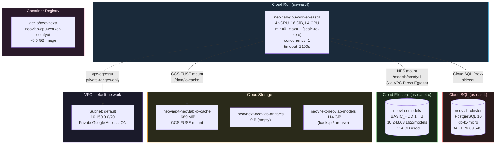

# GCP Services & Cost Estimate

> Project: **neovnext** | Region: **us-east4** | Last updated: 2026-03-26

## Architecture Diagram

## Service Inventory

| # | Service | Resource | Tier / Config | Region | Purpose |
|---|---------|----------|---------------|--------|---------|
| 1 | **Cloud Run** | `neovlab-gpu-worker-east4` | 4 vCPU, 16 GiB RAM, 1x NVIDIA L4 GPU, min-instances=0 (scale-to-zero) | us-east4 | ComfyUI GPU inference worker (WAN video, image gen) |
| 2 | **Cloud SQL** | `neovlab-cluster` | PostgreSQL 16, `db-f1-micro` (shared vCPU, 614 MiB RAM, 10 GB SSD) | us-east4 | Cluster database (job_queue, cache_manifest, worker_registry) |
| 3 | **Cloud Filestore** | `neovlab-models` | BASIC_HDD, 1 TiB capacity (~114 GB used) | us-east4-c | AI model storage via NFS (checkpoints, diffusion models, LoRAs, VAE, CLIP, text encoders) |
| 4 | **Cloud Storage** | `neovnext-neovlab-io-cache` | Standard, ~689 MiB | us-east4 | Job I/O cache (inputs + outputs), mounted via GCS FUSE |
| 5 | **Cloud Storage** | `neovnext-neovlab-artifacts` | Standard, 0 B (empty) | us-east4 | Future: persisted job artifacts |
| 6 | **Cloud Storage** | `neovnext-neovlab-models` | Standard, ~114 GiB | us-east4 | Backup/archive of all AI models (original source before Filestore) |
| 7 | **Container Registry** | `gcr.io/neovnext/neovlab-gpu-worker-comfyui` | ~8.5 GB image | us (multi-region) | Docker image for GPU worker |
| 8 | **VPC Network** | `default` | Auto-mode, subnet 10.150.0.0/20, Private Google Access enabled | us-east4 | Cloud Run VPC Direct Egress for NFS + Cloud SQL connectivity |
| 9 | **Compute Engine API** | (enabled, no active VMs) | - | - | Used for temp VMs (Filestore population), currently idle |

## Monthly Cost Estimate

> Cloud Run GPU is configured with `min-instances=0` (scale-to-zero).
> You only pay for GPU time when actively processing jobs. Cold starts take ~40-60s.

### Cloud Run GPU Worker (scale-to-zero: min=0)

| Component | Rate | Per-Hour Cost | Example: 4 hrs/day | Monthly |
|-----------|------|---------------|---------------------|---------|
| L4 GPU | $0.000463/GPU-second | $1.67/hr | 120 hrs | **$200** |
| CPU (4 vCPU) | $0.0864/hr (4 vCPU) | $0.35/hr | 120 hrs | **$42** |
| Memory (16 GiB) | $0.144/hr (16 GiB) | $0.14/hr | 120 hrs | **$17** |
| **Cloud Run subtotal** | | **$2.16/hr** | **120 hrs/mo** | **~$259/mo** |

> At 24/7 usage (730 hrs), Cloud Run would cost ~$1,576/mo. Scale-to-zero is critical.

### Cloud SQL

| Component | Rate | Monthly |
|-----------|------|---------|
| db-f1-micro (shared core) | $0.0150/hr | **~$11/mo** |
| 10 GB SSD storage | $0.17/GB/mo | **~$1.70/mo** |
| **Cloud SQL subtotal** | | **~$13/mo** |

### Cloud Filestore

| Component | Rate | Monthly |
|-----------|------|---------|
| BASIC_HDD 1 TiB (billed on provisioned capacity) | $0.044/GiB/mo x 1024 GiB | **~$45/mo** |
| **Filestore subtotal** | | **~$45/mo** |

### Cloud Storage

| Bucket | Size | Rate | Monthly |
|--------|------|------|---------|
| neovnext-neovlab-models | ~114 GiB | $0.020/GB/mo | **~$2.34/mo** |
| neovnext-neovlab-io-cache | ~689 MiB | $0.020/GB/mo | **~$0.01/mo** |
| neovnext-neovlab-artifacts | 0 B | - | **$0.00** |
| GCR images (hosted in GCS) | ~8.5 GB | $0.020/GB/mo | **~$0.17/mo** |
| **Storage subtotal** | | | **~$2.52/mo** |

### Networking

| Component | Estimate | Monthly |
|-----------|----------|---------|
| VPC egress (minimal, mostly internal) | ~negligible | **~$0** |
| Cloud SQL Auth Proxy | included | **$0** |
| NFS mount (same-zone traffic) | free | **$0** |

### Total Monthly Burn

| Category | Idle (0 hrs) | Light (4 hrs/day) | Heavy (24/7) |
|----------|-------------|-------------------|---------------|
| Cloud Run GPU | $0 | ~$259 | ~$1,576 |
| Cloud SQL | $13 | $13 | $13 |
| Cloud Filestore | $45 | $45 | $45 |
| Cloud Storage | $3 | $3 | $3 |
| Networking | $0 | $0 | $0 |
| **Total** | **~$61/mo** | **~$320/mo** | **~$1,637/mo** |

### Cost Reduction Levers

| Action | Savings | Status |
|--------|---------|--------|
| **Set min-instances=0** (scale to zero when idle) | ~$1,360/mo saved vs always-on | DONE |
| **Delete GCS models bucket** (now redundant with Filestore) | ~$2/mo | TODO |
| **Delete empty artifacts bucket** | $0 | TODO |
| **Downgrade Filestore to 256 GiB** (if tier allows, BASIC_HDD min=1 TiB) | N/A (1 TiB is minimum) | N/A |

> Cold starts take ~40-60s with Filestore NFS, acceptable for non-real-time workloads.
> Baseline idle cost with no GPU usage is ~$61/mo (Filestore + Cloud SQL + Storage).
