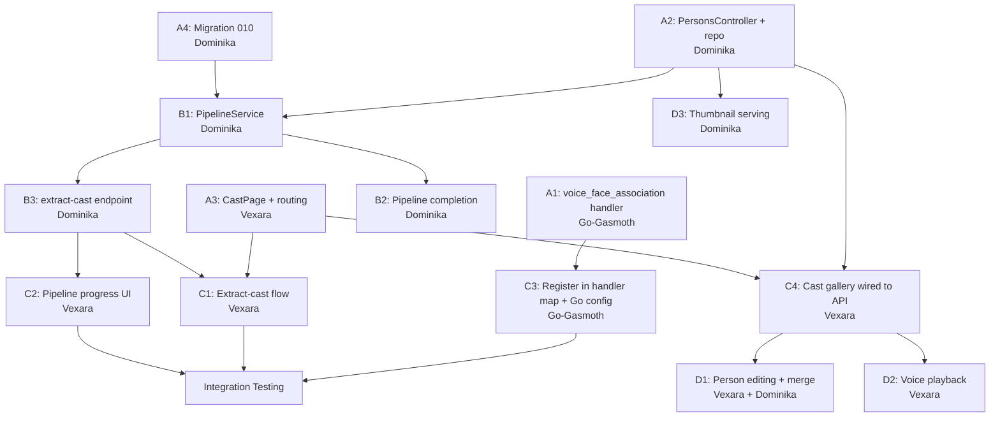

# Cast Members Feature — Implementation Plan

**Date:** 2026-03-26
**Author:** Lilithex (orchestrator)
**Status:** Draft — awaiting Steve's approval before delegation

---

## 1. Executive Summary

A new primary-navigation "Cast" tab where a user uploads a video and the system automatically extracts every person in it — face thumbnails, voice samples, speaker-labeled transcript segments, and time-of-appearance — then presents them as **cast member cards** the user can name and curate.

The feature is *almost* entirely composable from existing infrastructure: face extraction, face clustering, diarization, and transcription handlers all exist; the `persons` and `person_appearances` tables are already in the schema. What is missing is **the orchestration layer** (a composite job that chains these handlers), **the voice-to-face association step**, **the API surface for persons/cast**, and **the frontend page**.

---

## 2. What Already Exists

| Layer | Asset | Status |
|-------|-------|--------|
| **DB** | `persons` table (name, face_thumbnail, voice_sample_path, face/voice embeddings) | Ready |
| **DB** | `person_appearances` table (person_id, media_id, first/last_seen, source) | Ready |
| **DB** | `face_detections` table (embedding, bounding_box, person_id FK) | Ready |
| **DB** | `speaker_segments` table (speaker_label, audio_path, voice_embedding, person_id FK) | Ready |
| **DB** | `transcriptions` table (segments with timestamps) | Ready |
| **Handler** | `face_extraction.py` — InsightFace buffalo_l, 512-dim embeddings, thumbnails | Ready |
| **Handler** | `face_clustering.py` — agglomerative clustering, person creation, appearance records | Ready |
| **Handler** | `diarization.py` — pyannote 3.1, per-speaker WAV extraction | Ready |
| **Handler** | `transcription.py` — Whisper, word-level segments | Ready |
| **Python** | `cluster_db.py` — full CRUD for all tables above | Ready |
| **Go** | Supervisor dispatches all handlers, port-mapped, health-checked | Ready |
| **Go** | `face_clustering` already has port 9007 in config | Ready |
| **API** | `POST /api/jobs` with `{ mediaId, jobType }` enqueues any handler | Ready |
| **API** | `JobQueueService.ResolveWorkerFunction` routes job types to handlers | Ready |
| **Frontend** | `enqueueJob(mediaId, jobType)` API client function | Ready |
| **Frontend** | `MediaDetailPage` shows per-media jobs, artifacts, transcript | Ready |

## 3. What Needs To Be Built

### 3.1 New: Cast Extraction Pipeline Job (`cast_extraction`)

A **composite job type** that, when enqueued for a media item, triggers the following sequential pipeline:

```
Video Upload
    |
    v
[1] face_extraction (GPU)     [1] transcription (GPU)     [1] diarization (GPU)
    |                               |                           |
    v                               v                           v
[2] face_clustering (CPU)      [2] (results stored)       [2] (segments stored)
    |                               |                           |
    +-------------------------------+---------------------------+
    |
    v
[3] voice_face_association (CPU) — NEW HANDLER
    |
    v
[4] Person records finalized, API notified
```

Phase 1 jobs (face_extraction, transcription, diarization) can run **in parallel**.
Phase 2 (face_clustering) depends on face_extraction completing.
Phase 3 (voice_face_association) depends on face_clustering + diarization completing.

### 3.2 New: `voice_face_association` Handler

A new Python handler that:
1. Reads `face_detections` (with person_id set by clustering) for the media
2. Reads `speaker_segments` for the media
3. For each speaker label, finds which person was visible during that speaker's segments using temporal overlap
4. Sets `person_id` on matching `speaker_segments`
5. Computes voice embeddings (optional, for cross-media re-identification) using speechbrain or resemblyzer
6. Updates `persons` records with `voice_sample_path` and `voice_embedding`
7. Updates `persons.face_thumbnail` to the best (highest-confidence) face crop path

### 3.3 New: Pipeline Orchestrator in the API

A service method that, given a `cast_extraction` job type:
1. Enqueues face_extraction, transcription, and diarization as **child jobs** (Phase 1)
2. When all Phase 1 completes, enqueues face_clustering (Phase 2)
3. When Phase 2 completes, enqueues voice_face_association (Phase 3)
4. When Phase 3 completes, marks the parent `cast_extraction` job as `completed`

**Implementation approach:** Use a `pipeline_jobs` table to track parent-child relationships and completion dependencies. The API polls or receives webhook callbacks for child job completion.

### 3.4 New: Persons API Endpoints

| Method | Path | Purpose |
|--------|------|---------|
| `GET` | `/api/persons` | List all persons (with pagination, optional media_id filter) |
| `GET` | `/api/persons/{personId}` | Get person detail with appearances |
| `PUT` | `/api/persons/{personId}` | Update person (name, merge with another) |
| `DELETE` | `/api/persons/{personId}` | Delete person (cascades to unlink detections/segments) |
| `GET` | `/api/persons/{personId}/appearances` | List media appearances |
| `GET` | `/api/persons/{personId}/thumbnail` | Serve face thumbnail image |
| `GET` | `/api/persons/{personId}/voice-sample` | Serve voice sample audio |
| `POST` | `/api/media/{mediaId}/extract-cast` | Trigger cast extraction pipeline for a video |
| `GET` | `/api/media/{mediaId}/cast` | Get all persons appearing in a specific media |

### 3.5 New: Frontend "Cast" Page

A new primary-nav tab (alongside Catalog and Ingest) showing:

1. **Cast Gallery** — Grid of person cards, each showing:
   - Face thumbnail (best crop from face_clustering)
   - Name (editable, defaults to "Unknown Person #N")
   - Number of media appearances
   - Voice sample play button (if available)
   - Click to expand detail

2. **Upload / Extract Flow** — From the Cast page, user can:
   - Select an existing video from catalog OR upload a new one
   - Click "Extract Cast" to trigger the pipeline
   - See a pipeline progress indicator (Phase 1/2/3 with per-step status)

3. **Person Detail View** — When clicking a cast member:
   - All appearances across media (with timestamps, clickable to MediaDetailPage)
   - Face thumbnail gallery (all detections for this person)
   - Voice sample player
   - Editable name field
   - Merge with another person (drag & drop or picker)

### 3.6 New: Database Migration `010_pipeline_jobs.sql`

```sql
-- 010_pipeline_jobs.sql: Pipeline orchestration for composite job types.

CREATE TABLE IF NOT EXISTS pipeline_jobs (
    pipeline_id    TEXT PRIMARY KEY DEFAULT gen_random_uuid()::TEXT,
    parent_job_id  TEXT NOT NULL REFERENCES job_queue(job_id) ON DELETE CASCADE,
    child_job_id   TEXT NOT NULL REFERENCES job_queue(job_id) ON DELETE CASCADE,
    phase          INTEGER NOT NULL,
    depends_on     TEXT[],  -- child_job_ids that must complete before this phase starts
    created_at     TIMESTAMPTZ NOT NULL DEFAULT NOW()
);

CREATE INDEX IF NOT EXISTS idx_pipeline_jobs_parent ON pipeline_jobs(parent_job_id);
CREATE INDEX IF NOT EXISTS idx_pipeline_jobs_child ON pipeline_jobs(child_job_id);
```

### 3.7 Updates to `handler_config` Seed Data

```sql
INSERT INTO handler_config (worker_function, enabled, priority, updated_at)
VALUES
    ('face_clustering',          TRUE, 5, NOW()),
    ('voice_face_association',   TRUE, 5, NOW())
ON CONFLICT (worker_function) DO NOTHING;
```

---

## 4. Phase Breakdown

### Phase A: Foundation (can be done in parallel)

| Task | Agent | Dependencies |
|------|-------|-------------|
| A1: `voice_face_association` handler (Python) | Go-Gasmoth | None |
| A2: `PersonsController.cs` + repository + cluster DB queries | Dominika | None |
| A3: `CastPage.tsx` + routing + API client types | Vexara | None |
| A4: Migration `010_pipeline_jobs.sql` | Dominika | None |

### Phase B: Pipeline Orchestration (depends on A2, A4)

| Task | Agent | Dependencies |
|------|-------|-------------|
| B1: `PipelineService.cs` — enqueue child jobs, track phases | Dominika | A2, A4 |
| B2: Pipeline completion webhook / polling in API | Dominika | B1 |
| B3: `POST /api/media/{mediaId}/extract-cast` endpoint | Dominika | B1 |

### Phase C: Integration (depends on A1, A3, B3)

| Task | Agent | Dependencies |
|------|-------|-------------|
| C1: Frontend extract-cast flow wired to API | Vexara | A3, B3 |
| C2: Pipeline progress UI (polling job statuses) | Vexara | B3 |
| C3: Register `voice_face_association` in handler map + Go config | Go-Gasmoth | A1 |
| C4: Cast gallery wired to `GET /api/persons` | Vexara | A2, A3 |

### Phase D: Polish (depends on C)

| Task | Agent | Dependencies |
|------|-------|-------------|
| D1: Person name editing, merge functionality | Vexara + Dominika | C4 |
| D2: Voice sample playback in UI | Vexara | C4 |
| D3: Face thumbnail serving via API | Dominika | A2 |

---

## 5. Detailed Agent Assignments

### 5.1 Dominika (API Dominatrix) — C# Backend

**Files to create:**
- `src/backend/NeoVLab.Api/Controllers/PersonsController.cs`
- `src/backend/NeoVLab.Api/Repositories/IPersonRepository.cs`
- `src/backend/NeoVLab.Api/Repositories/PersonRepository.cs`
- `src/backend/NeoVLab.Api/Models/PersonRecord.cs`
- `src/backend/NeoVLab.Api/Models/PersonAppearanceRecord.cs`
- `src/backend/NeoVLab.Api/Services/PipelineService.cs`
- `src/data/migrations/cluster/010_pipeline_jobs.sql`

**Files to modify:**
- `src/backend/NeoVLab.Api/Controllers/MediaController.cs` — add `extract-cast` and `cast` endpoints
- `src/backend/NeoVLab.Api/Services/JobQueueService.cs` — add `cast_extraction`, `face_clustering`, `voice_face_association` to `ResolveProcessingType` and `ResolveWorkerFunction`
- `src/backend/NeoVLab.Api/Program.cs` — register `PipelineService`, `IPersonRepository`

**API Contracts:**

```
GET /api/persons?page=1&pageSize=20&mediaId=optional
Response: {
  items: [{
    personId: string,
    name: string | null,
    faceThumbnailUrl: string | null,
    voiceSampleUrl: string | null,
    autoGenerated: boolean,
    appearanceCount: number,
    createdAt: string,
    updatedAt: string
  }],
  page: number,
  pageSize: number,
  totalCount: number
}

GET /api/persons/{personId}
Response: {
  personId: string,
  name: string | null,
  faceThumbnailUrl: string | null,
  voiceSampleUrl: string | null,
  autoGenerated: boolean,
  appearances: [{
    appearanceId: string,
    mediaId: string,
    mediaFileName: string,
    firstSeenSec: number,
    lastSeenSec: number,
    detectionCount: number,
    source: string
  }],
  createdAt: string,
  updatedAt: string
}

PUT /api/persons/{personId}
Request: { name: string }
Response: PersonRecord

DELETE /api/persons/{personId}
Response: 204

POST /api/media/{mediaId}/extract-cast
Response: {
  pipelineJobId: string,
  childJobs: [{
    jobId: string,
    jobType: string,
    phase: number,
    status: string
  }]
}

GET /api/media/{mediaId}/cast
Response: {
  mediaId: string,
  persons: [PersonRecord with appearance info for this media]
}
```

### 5.2 Go-Gasmoth — Python Handler + Go Config

**Files to create:**
- `src/workers/handlers/voice_face_association.py`

**Files to modify:**
- `src/workers/handlers/__init__.py` — add `voice_face_association` to `HANDLER_MAP`
- `src/gpu-supervisor/internal/config/config.go` — add `"voice_face_association": 9008` to `HandlerPorts`
- `src/workers/cluster_db.py` — add `update_speaker_segment_person_id()`, `update_person_voice()`, `get_persons_for_media()`, `update_person_thumbnail()`

**Handler contract (voice_face_association.py):**
```python
def init() -> None:
    """Verify dependencies (numpy, optional speechbrain)."""

def handle(input_path: str, output_dir: str, **kwargs) -> dict:
    """
    Reads from DB:
      - face_detections with person_id (set by face_clustering) for media_id
      - speaker_segments for media_id
      - persons created by face_clustering

    Algorithm:
      1. Group face detections by person_id with their timestamps
      2. Group speaker segments by speaker_label with their time ranges
      3. For each speaker_label, compute temporal overlap with each person
      4. Assign speaker -> person by maximum overlap
      5. Set person_id on speaker_segments
      6. Pick best voice sample per person (longest segment >= 3s)
      7. Update persons.voice_sample_path and persons.face_thumbnail

    Returns summary JSON artifact.
    """
```

### 5.3 Vexara (Frontend Demoness) — React Frontend

**Files to create:**
- `src/frontend/src/pages/CastPage.tsx`
- `src/frontend/src/components/cast/CastGallery.tsx`
- `src/frontend/src/components/cast/PersonCard.tsx`
- `src/frontend/src/components/cast/PersonDetailPanel.tsx`
- `src/frontend/src/components/cast/ExtractCastButton.tsx`
- `src/frontend/src/components/cast/PipelineProgress.tsx`
- `src/frontend/src/hooks/usePersons.ts`
- `src/frontend/src/hooks/useCastExtraction.ts`

**Files to modify:**
- `src/frontend/src/App.tsx` — add `/cast` route under PrimaryLayout
- `src/frontend/src/components/layout/TopBar.tsx` — add Cast tab to `PRIMARY_TABS`
- `src/frontend/src/api/client.ts` — add persons API client functions

**UI Components:**

`CastPage.tsx`:
- Tab header: "Cast"
- Two sections: "Extract Cast" panel (top) + Cast Gallery (below)
- Extract panel: media picker (dropdown of video-type media from catalog) + "Extract Cast" button
- Gallery: responsive grid of `PersonCard` components
- Click person -> slide-out `PersonDetailPanel`

`PersonCard.tsx`:
- Face thumbnail (fallback to silhouette icon)
- Editable name (inline click-to-edit)
- Appearance count badge
- Voice sample play button (small, inline)

`PipelineProgress.tsx`:
- Three-phase progress bar
- Per-phase status (queued/running/completed/failed)
- Polls `GET /api/jobs/{pipelineJobId}` + child jobs

---

## 6. Architecture Decisions

### 6.1 Pipeline Orchestration: DB-driven vs. in-memory

**Decision:** DB-driven via `pipeline_jobs` table.
**Rationale:** The API process may restart during a long pipeline. DB-driven orchestration survives restarts and is observable via the Jobs page. A `PipelineService` polls for completed child jobs and advances phases.

### 6.2 Cast Page as Primary Tab vs. Admin Tab

**Decision:** Primary tab (alongside Catalog and Ingest).
**Rationale:** This is a core user-facing feature, not an admin/debug tool. It belongs in the main navigation where users spend their time.

### 6.3 Voice Embedding Model

**Decision:** Defer voice embeddings to Phase D (optional enhancement).
**Rationale:** The temporal overlap algorithm (face visible while speaker active) is sufficient for single-video cast extraction. Voice embeddings become necessary for cross-media speaker re-identification, which is a follow-up feature.

### 6.4 Video Upload vs. Catalog Selection

**Decision:** Support both. Allow selecting from existing catalog videos OR uploading a new one (which goes through the existing ingest pipeline first, then triggers cast extraction).
**Rationale:** Most users will want to work with already-ingested media. Direct upload is a convenience shortcut.

### 6.5 Face Clustering: Already Handles person_id Assignment

**Decision:** No changes to `face_clustering.py` needed.
**Rationale:** The handler already (a) clusters faces, (b) matches to existing persons or creates new ones, (c) sets `person_id` on `face_detections`, (d) creates `person_appearances` records. It works perfectly as Phase 2.

---

## 7. Open Questions & Risks

### Open Questions

1. **Pipeline polling frequency** — How often should PipelineService check for child job completion? Proposal: 5-second polling interval.

2. **Person merge UX** — When two clusters are actually the same person (e.g., profile vs. frontal), what is the merge interaction? Proposal: drag one card onto another, confirm dialog, DB merges all references.

3. **Video-only constraint** — Should `extract-cast` reject non-video media (images, audio-only)? Proposal: yes for V1; audio-only could support diarization-only in V2.

### Risks

1. **GPU contention** — Running face_extraction + transcription + diarization simultaneously on a single L4 may cause OOM. Mitigation: the existing `ModeShared` / `ModeExclusive` transitions in the Go supervisor handle this. face_extraction and diarization both use GPU; the supervisor will serialize them if VRAM is tight.

2. **Pipeline failure recovery** — If Phase 1 partially fails (e.g., diarization fails but face_extraction succeeds), the pipeline should still complete with partial results rather than blocking entirely. PipelineService should handle partial completion gracefully.

3. **Long-running pipelines** — A full cast extraction on a feature-length video could take 20-30 minutes. The frontend must handle this gracefully with progress updates and not appear frozen.

---

## 8. Dependency Graph (Mermaid)



---

## 9. Estimated Effort

| Phase | Parallelism | Estimated Time |
|-------|-------------|----------------|
| Phase A | All 4 tasks in parallel | 3-4 hours |
| Phase B | Sequential (B1 -> B2 -> B3) | 2-3 hours |
| Phase C | 4 tasks in parallel | 2-3 hours |
| Phase D | Polish, parallel | 2 hours |
| **Total** | | **9-12 hours** (wall-clock ~5-6 hours with parallelism) |
